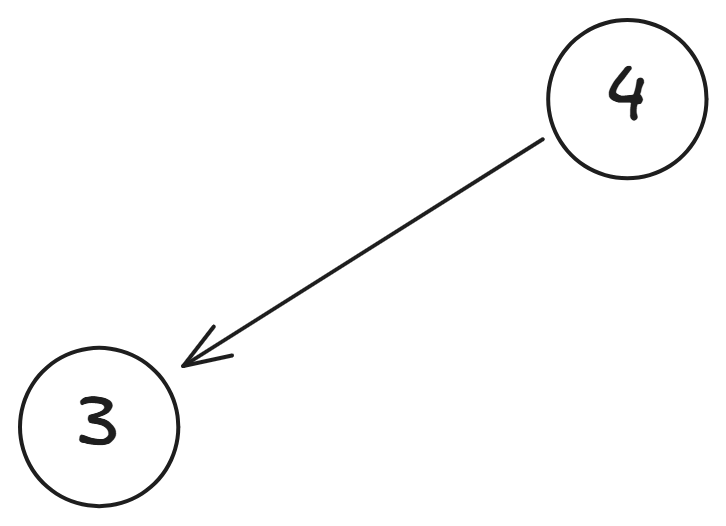
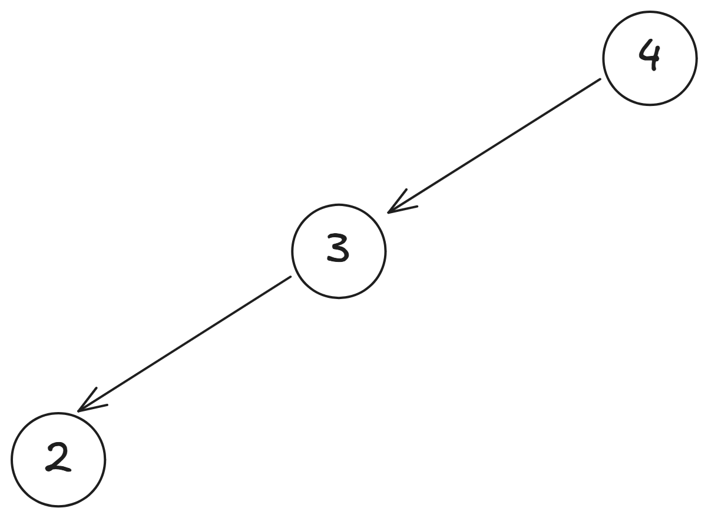
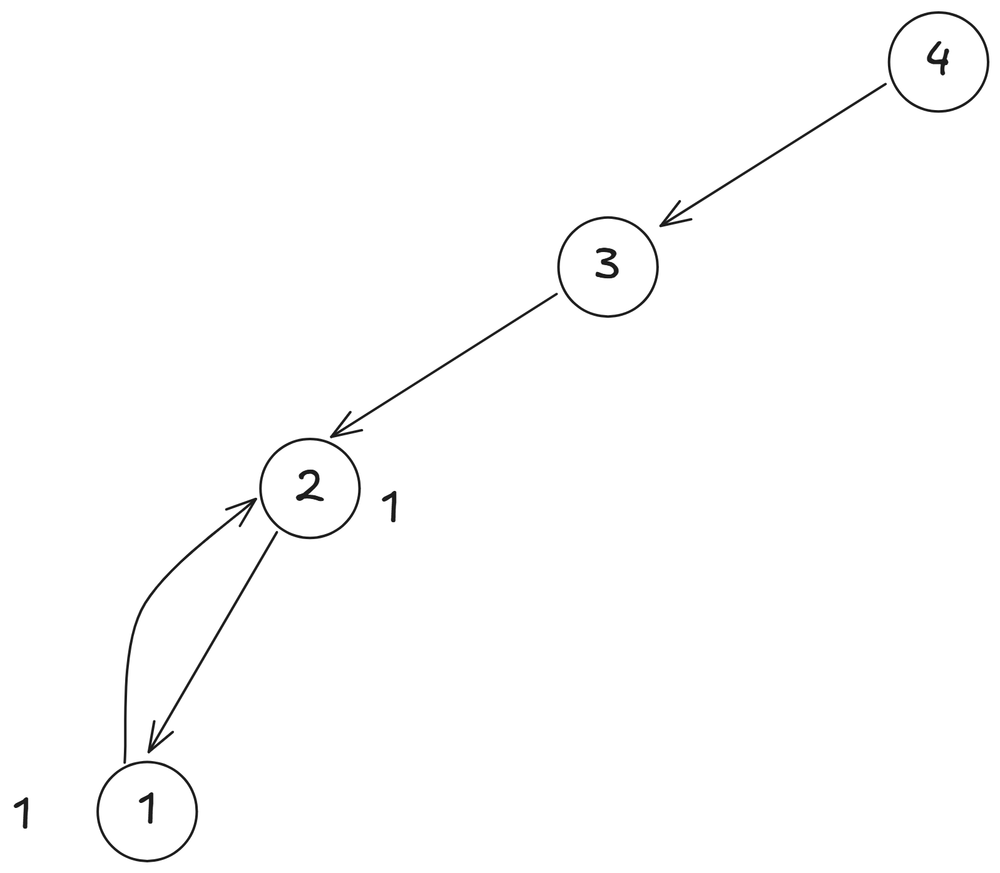
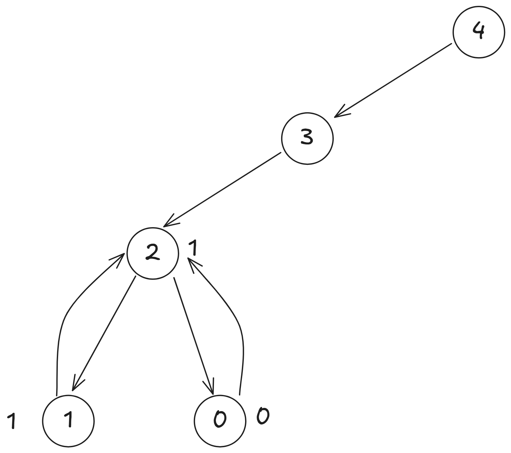
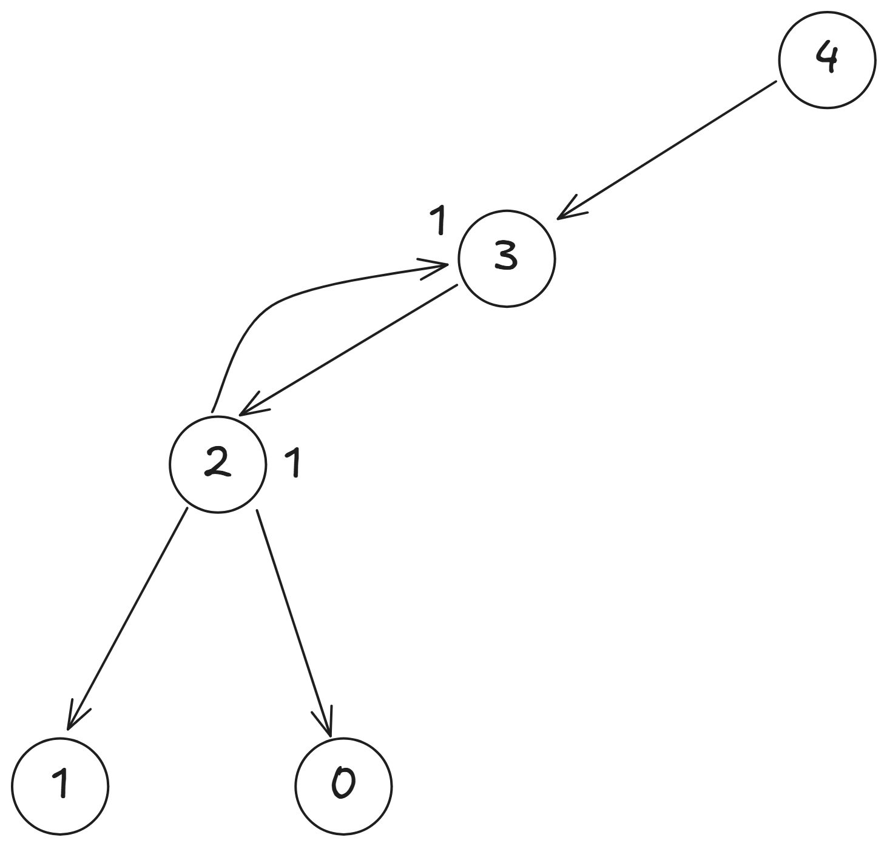
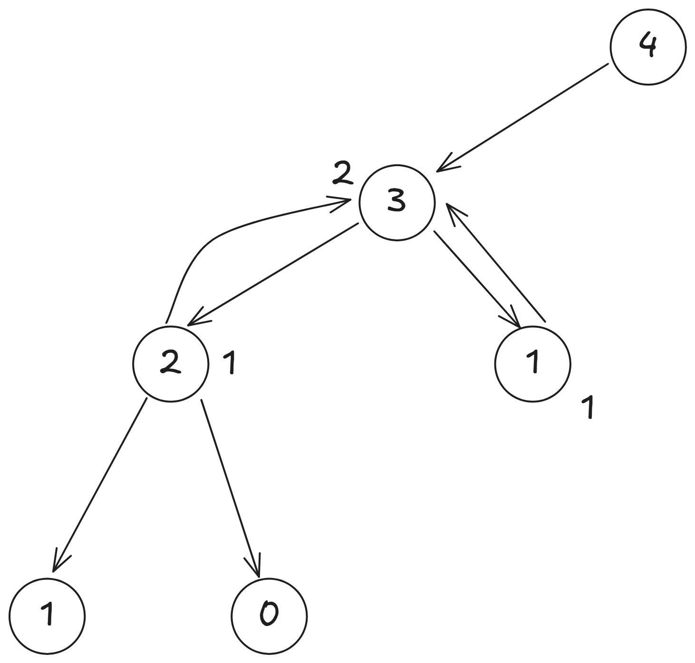
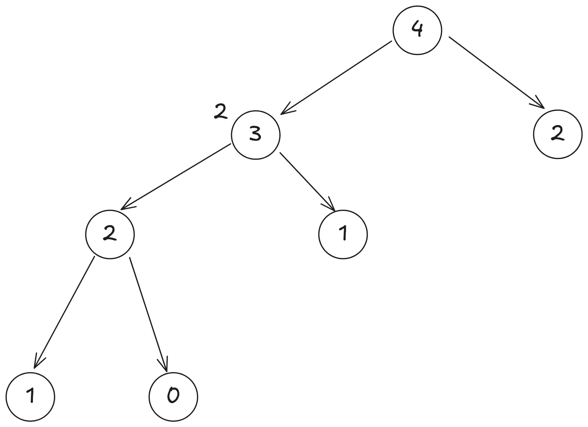
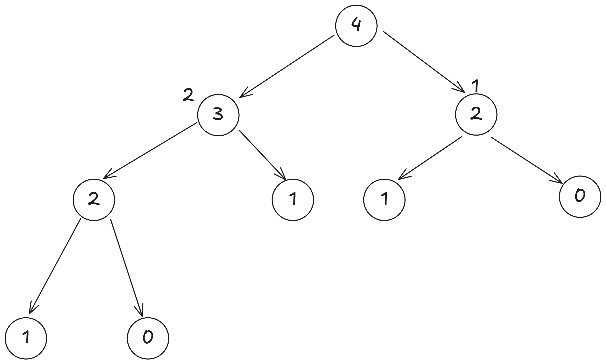

# 副函式與遞迴

~~~admonish note title="作者"
D1stance (吳翰平)
~~~

## 副函式

之前的各個章節，我們很常使用到像是 `strlen()`、`strcpy()` 等語法，
這些都是 C/C++ 的標準函式庫所提供的函式。

而函式（Function）是程式語言中一個非常重要的概念，
它可以讓我們將一段程式碼封裝起來，並且在需要的時候重複使用。

這種封裝的方式，可以讓程式碼更易讀、更易維護，
當程式碼規模很大的時候，使用函式可以讓我們更容易地理解程式碼的結構。

除了標準函式庫提供的函式之外，我們也可以自己定義函式，
`main` 其實就是一個特別的函式，
它是程式的入口點，當程式執行時，系統會先執行 `main` 函式。

我們也能自定義自己的函式，這些自己定義的函式稱為副函式（Subroutine）或子函式（Subfunction）。

### 函式宣告

副函式的宣告方式如下：

```c
return_type function_name(parameter_list) {
    // 函式的程式碼
}
```

其中，`return_type` 是函式的返回值類型，`function_name` 是函式的名稱，`parameter_list` 是函式的參數列表。
如果函式沒有返回值，則 `return_type` 可以使用 `void`。
如果函式有返回值，則需要使用 `return` 語句來返回值。

#### 範例

```c++
#include <iostream>
using namespace std;
int add(int a, int b)
{
    return a + b;
}

int main()
{
    int x = 5, y = 10;
    int result = add(x, y);
    cout << "The sum of " << x << " and " << y << " is: " << result << '\n';
    return 0;
}
```

在這個範例中，我們定義了一個名為 `add` 的副函式，
它接受兩個整數參數 `a` 和 `b`，並返回它們的和。
在 `main` 函式中，我們呼叫了 `add` 函式，並將結果存儲在 `result` 變數中，

參數列表你可以想像成是函式的輸入，
我們可以設計各種不同型態的參數，
例如整數、浮點數、字串等，
這樣我們就可以在函式中使用這些參數來執行特定的操作。

#### 範例

```c++
#include <iostream>
using namespace std;

double pow(double base, int exponent)
{
    double result = 1.0;
    for(int i = 0; i < exponent; ++i)
        result *= base;
    return result;
}

int main()
{
    double base;
    int exponent;
    cin >> base;
    cin >> exponent;
    double result = pow(base, exponent);
    cout << result << '\n';
    return 0;
}
```

在這個範例中，我們定義了一個名為 `pow` 的副函式，
它接受一個浮點數 `base` 和一個整數 `exponent` 作為參數，
並返回 `base` 的 `exponent` 次方。

根據你的需求，你可以設計各種不同的副函式，
當然也可以不放入任何參數，
跟變數命名一樣，函數名稱也應該具有描述性，
這樣可以讓其他人更容易理解你的程式碼。

### 原型宣告

在副函式的使用中，如果依照剛才的宣告方式是有先後順序的，
也就是說，副函式必須在使用之前被宣告或定義，跟變數一樣，
如果我們在 `main` 函式中使用了某個副函式，但這個副函式還沒有被定義，
編譯器會報錯。

這時有另外一種宣告的方式，稱為原型宣告（Function Prototype）。

原型宣告可以讓我們在使用副函式之前先告訴編譯器這個函式的存在，
之後再在程式的其他地方定義它。

#### 範例

```c++
#include <iostream>
using namespace std;

// 原型宣告
int add(int, int);
int sub(int, int);

int main()
{
    int x = 5, y = 10;
    int sum = add(x, y);
    int difference = sub(x, y);
    cout << sum << " " << difference << '\n';
    return 0;
}

// 副函式定義
int sub(int a, int b)
{
    return a - b;
}
int add(int a, int b)
{
    return a + b;
}
```
在這個範例中，我們先使用原型宣告 `int add(int, int);` 和 `int sub(int, int);`，
然後在 `main` 函式中使用這兩個副函式。
最後在 `main` 函式之後定義了這兩個副函式。

這樣的寫法可以讓我們在程式中更靈活地使用副函式，
而不需要擔心函式的定義順序。

## 函式的重載

在 C++ 中，我們可以定義多個同名的函式，只要它們的參數列表不同，
這稱為函式的重載（Function Overloading）。
這樣可以讓我們使用相同的函式名稱來處理不同類型或數量的參數。

### 範例

```c++
#include <iostream>
using namespace std;
int add(int a, int b)
{
    return a + b;
}
double add(double a, double b)
{
    return a + b;
}
double add(double a, double b, double c)
{
    return a + b + c;
}

int main()
{
    int x = 5, y = 10;
    double a = 2.5, b = 3.5, c = 4.5;
    cout << "Integer addition: " << add(x, y) << '\n';
    cout << "Double addition: " << add(a, b) << '\n';
    cout << "Triple double addition: " << add(a, b, c) << '\n';
    return 0;
}
```

在這個範例中，我們定義了三個名為 `add` 的函式，
它們的參數列表不同：
1. 第一個 `add` 函式接受兩個整數參數。
2. 第二個 `add` 函式接受兩個浮點數參數。
3. 第三個 `add` 函式接受三個浮點數參數。
這樣我們就可以使用相同的函式名稱來處理不同類型或數量的參數，
而不需要為每個函式都取一個不同的名稱。

## 函式與指標跟參考

在 C++ 中，函式的參數其實是透過複製一份變數，
然後將這份複製的變數傳遞給函式，
這樣在函式內部對參數的修改不會影響到原始變數。

假設我們現在要實現一個交換的函式，
如果我們直接使用值傳遞的方式，交換後的結果不會影響到原始變數。

### 範例

```c++
#include <iostream>
using namespace std;
void swap(int a, int b)
{
    int temp = a;
    a = b;
    b = temp;
}
int main()
{
    int x = 5, y = 10;
    swap(x, y);
    cout << "After swap: x = " << x << ", y = " << y << '\n'; // x 和 y 不會被交換
    return 0;
}
```

在這個範例中，我們定義了一個名為 `swap` 的函式，
它接受兩個整數參數 `a` 和 `b`，並試圖交換它們的值。
但是，由於我們使用的是值傳遞的方式，
在 `swap` 函式內部對 `a` 和 `b` 的修改不會影響到 `main` 函式中的 `x` 和 `y`。

要讓 `swap` 函式能夠修改原始變數的值，我們可以使用指標或參考。

**使用指標**

使用指標可以讓我們直接操作變數的記憶體地址，
這樣在函式內部對參數的修改就會影響到原始變數。
#### 範例

```c++
#include <iostream>
using namespace std;

void swap(int* a, int* b)
{
    int temp = *a;
    *a = *b;
    *b = temp;
}

int main()
{
    int x = 5, y = 10;
    swap(&x, &y); // 傳遞 x 和 y 的地址
    cout << "After swap: x = " << x << ", y = " << y << '\n'; // x 和 y 會被交換
    return 0;
}
```

在這個範例中，我們定義了一個名為 `swap` 的函式，
它接受兩個整數指標參數 `a` 和 `b`。
在 `swap` 函式內部，我們使用 `*a` 和 `*b` 來訪問指標所指向的值，
並進行交換。

在 `main` 函式中，我們使用 `&x` 和 `&y` 傳遞 `x` 和 `y` 的地址，
這樣 `swap` 函式就能夠直接修改 `x` 和 `y` 的值。

**使用參考**
使用參考可以讓我們更簡潔地實現類似的功能，
參考是一種別名，它允許我們在函式內部直接操作原始變數，而不需要使用指標。
#### 範例

```c++
#include <iostream>
using namespace std;
void swap(int& a, int& b)
{
    int temp = a;
    a = b;
    b = temp;
}

int main()
{
    int x = 5, y = 10;
    swap(x, y); // 傳遞 x 和 y 的參考
    cout << "After swap: x = " << x << ", y = " << y << '\n'; // x 和 y 會被交換
    return 0;
}
```

在這個範例中，我們定義了一個名為 `swap` 的函式，
它接受兩個整數參考參數 `a` 和 `b`。
在 `swap` 函式內部，我們可以直接使用 `a` 和 `b` 來訪問原始變數，
並進行交換。
在 `main` 函式中，我們直接傳遞 `x` 和 `y`，
這樣 `swap` 函式就能夠直接修改 `x` 和 `y` 的值。
這樣的寫法比使用指標更簡潔，也更容易理解。

~~~admonish info title="練習題"

每個人心中的觀念，處理事情的方法，都會形成一個固定的模式，就如同函式一樣，
而兩人相戀，處理事情的方式則會彼此融合，則如同函式的結合，給定你兩個函式 $L(x),G(x)$ 求 $L(G(x))$。
$L(x) = 4 \times x+2$
$G(x) = 8 \times x+17$

#### 輸入格式
輸入一個整數 $x$。
#### 輸出格式
輸出 $L(G(x))$ 的值。
#### 技術規格
$1 \le x \le 10^6$
#### 範例
**輸入**

1

**輸出**

102
~~~

~~~admonish note title="解答" collapsible=true

```c++
#include <iostream>
using namespace std;

int L(int);
int G(int);

int main()
{
    int x;
    cin >> x;
    cout << L(G(x)) << '\n';
    return 0;
}
int L(int x)
{
    return 4 * x + 2;
}
int G(int x)
{
    return 8 * x + 17;
}
```

~~~

## 遞迴

函式除了可以分區功能以及重複使用之外，
我們也可以將問題用函示來切分，像是將陣列分成左右兩邊，
分別去處理問題，但是處理的邏輯是相同的，
這種情況下，我們可能會呼叫跟自己相同的函式，只是參數不同，
這種情況稱為遞迴（Recursion）。

遞迴是一種解決問題的方法，是指函式在其定義中呼叫自己，
這樣可以將一個大問題分解為多個小問題，
每次呼叫函式時，問題的規模都會縮小，
直到達到一個很小可以直接求解的情況。

我們來看一個非常經典的例子，費式數列（Fibonacci Sequence），
費式數列的定義是：
- $F(0) = 0$
- $F(1) = 1$
- $F(n) = F(n-1) + F(n-2)$ 當 $n > 1$

我們可以從數列中的定義發現，$F(n)$ 的值是由 $F(n-1)$ 和 $F(n-2)$ 的值決定的，
而 $F(n-1)$ 和 $F(n-2)$ 又可以分解為更小的問題，
直到可以直接得出答案的 $F(0)$ 和 $F(1)$。

我們以 $F(4)$ 為例，來看看求解的過程：


從圖中可以看到，$F(4)$ 的值是由 $F(3)$ 和 $F(2)$ 的值決定的，但我們還不知道 $F(3)$ 的值，
我們先從 $F(3)$ 繼續分解，



這樣我們就可以看到，$F(3)$ 的值是由 $F(2)$ 和 $F(1)$ 的值決定的，但我們還不知道 $F(2)$ 的值，所以繼續分解 $F(2)$，



而 $F(2)$ 又可以分解為 $F(1)$ 和 $F(0)$，



因為 $F(1) = 1$ 是已知的，所以我們可以去看 $F(0)$，



$F(0) = 0$ 也是已知的，
所以我們可以算出 $F(2) = 1$。



接著我們可以回到 $F(3)$，
因為 $F(2) = 1$，所以可以去看 $F(1)$，



$F(3) = 1 + 1 = 2$。

最後我們可以回到 $F(4)$，
但是右邊的 $F(2)$ 因為我們沒有儲存答案，
也不是可以直接得知的，
所以要繼續分解 $F(2)$，



跟剛才算的過程一樣，算出 $F(2) = 2$，



然後回到 $F(4)$，
因為 $F(3) = 2$ 和 $F(2) = 1$，
所以我們可以算出 $F(4) = 3$。


這樣的過程就是遞迴的過程，
每次呼叫函式時，都在解決一個更小的問題，
直到達到基本情況（base case），
然後再逐步回到原來的問題。

在實作遞迴時，我們需要注意兩個重要的部分：
1. **基本情況（Base Case）**：這是遞迴的終止條件，當達到這個條件時，函式不再呼叫自己，而是直接返回一個值。
2. **遞迴呼叫（Recursive Call）**：這是函式在其定義中呼叫自己，並且使用更小的問題來解決原始問題。

在實作遞迴時，我們需要確保每次呼叫函式時，問題的規模都在縮小，
並且最終能夠達到基本情況，這樣才能避免無限遞迴導致程式崩潰。

## 遞迴的實作
在 C++ 中，我們可以使用函式來實作遞迴，
函式的定義方式跟一般的函式一樣，
但是在函式內部，我們需要使用遞迴呼叫來解決問題。

```c++
#include <iostream>
using namespace std;
int fibonacci(int n)
{
    if(n == 0)
        return 0;
    if(n == 1)
        return 1;
    return fibonacci(n - 1) + fibonacci(n - 2); // 遞迴呼叫
}
int main()
{
    int n;
    cin >> n;
    cout << "Fibonacci(" << n << ") = " << fibonacci(n) << '\n';
    return 0;
}
```

在這個範例中，我們定義了一個名為 `fibonacci` 的函式，
它接受一個整數參數 `n`，並返回費式數列的第 `n` 項。
在 `fibonacci` 函式中，我們使用了兩個 base case 來處理遞迴的終止條件：
1. 當 `n` 等於 0 時，返回 0。
2. 當 `n` 等於 1 時，返回 1。
如果 `n` 大於 1，我們就使用遞迴呼叫 `fibonacci(n - 1)` 和 `fibonacci(n - 2)`，
並將它們的結果相加，返回費式數列的第 `n` 項。

這樣的寫法可以讓我們很簡潔地實現費式數列的計算，
但是因為沒有使用任何額外的資料結構來儲存已經計算過的值，
所以這個遞迴的實現方式在計算較大的 `n` 時會非常慢，
因為會重複計算很多次相同的值。

~~~admonish info title="練習題"
請實作一個函式 `factorial`，計算給定整數 `n` 的階乘（Factorial），
階乘的定義是：
- $0! = 1$
- $n! = n \times (n-1)!$ 當 $n > 0$
#### 輸入格式
輸入一個整數 $n$。
#### 輸出格式
輸出 $n!$ 的值。
#### 技術規格
- $0 \le n \le 20$
#### 範例
**輸入**

5

**輸出**

120
~~~

~~~admonish note title="解答" collapsible=true

```c++
#include <iostream>
using namespace std;
long long factorial(int n)
{
    if(n == 0)
        return 1; // 基本情況
    return n * 1ll * factorial(n - 1);
    // 因為階乘的值可能會很大，但 int 乘 factorial(n - 1) 可能會溢位，
    // 所以使用 1ll 來確保計算結果是 long long 型態
}
int main()
{
    int n;
    cin >> n;
    cout << factorial(n) << '\n'; // 輸出階乘的值
    return 0;
}
```
~~~

### 遞迴的優化
在遞迴的實作中，特別是像費式數列這樣的問題，
我們會發現有很多重複計算的部分，
這會導致效率非常低下。

我們其實可以使用陣列將已經計算過的值儲存起來，
這樣在需要計算相同的值時，就可以直接從陣列中取出，而不需要再次計算，
這種技術稱為**記憶化遞迴**（Memoization）。

```c++
#include <iostream>
using namespace std;
const int MAX_N = 1000; // 假設 n 的最大值為 1000
int memo[MAX_N]; // 儲存已計算過的值

int fibonacci(int n)
{
    if(n == 0)
        return 0;
    if(n == 1)
        return 1;
    if(memo[n] != -1) // 如果已經計算過，直接返回
        return memo[n];
    memo[n] = fibonacci(n - 1) + fibonacci(n - 2); // 計算並儲存結果
    return memo[n];
}
int main()
{
    int n;
    cin >> n;
    memset(memo, -1, sizeof(memo)); // 初始化 memo 陣列
    cout << "Fibonacci(" << n << ") = " << fibonacci(n) << '\n';
    return 0;
}
```

在這個範例中，我們使用了一個名為 `memo` 的陣列來儲存已經計算過的費式數列的值。
在 `fibonacci` 函式中，我們首先檢查 `memo[n]` 是否已經被計算過，
如果已經計算過，就直接返回 `memo[n]` 的值。

這裡用到一個東西叫做 `memset`，
它是 C/C++ 中的一個函式，用來初始化一個陣列或記憶體區域。
在這個例子中，我們使用 `memset(memo, -1, sizeof(memo));` 來將 `memo` 陣列的所有元素初始化為 -1，
這樣我們可以用 -1 來表示這個位置還沒有被計算過。

但 `memset` 只能用來初始化為 0 或 -1，
如果我們需要初始化為其他值，可以使用迴圈來完成。

而這個用陣列來儲存已經計算過的值的方式，
可以大幅提高遞迴的效率，被稱為 **記憶化搜索**（Memoization）或動態規劃（Dynamic Programming），我們在日後會詳細介紹動態規劃的概念。

## 輾轉相除法

不知道大家知不知道最大公因數這個東西，最大公因數指的是，對於兩個非負整數 $a$ 和 $b$，
最大公因數是能夠同時整除 $a$ 和 $b$ 的最大正整數，
我們用符號 $\gcd(a, b)$ 來表示最大公因數。
在數學上，最大公因數有很多應用，例如在簡化分數、求最小公倍數等方面。

最直覺的做法就是，從 $a$ 和 $b$ 中取較小的數，然後從該數字開始，往下檢查每個數字是否能夠同時整除 $a$ 和 $b$，
直到找到第一個能夠同時整除的數字為止。
這種方法雖然簡單，但效率很低，特別是當 $a$ 和 $b$ 很大時。

這時候可能有些人高中數學會學到輾轉相除法（Euclidean Algorithm），這是一種更有效的計算最大公因數的方法。

輾轉相除法的基本思想是：
如果 $a$ 和 $b$ 的最大公因數是 $g$，那麼 $g$ 也會是 $b$ 和 $a \bmod b$ 的最大公因數，$\bmod$ 指的是取餘數的運算，$5 \bmod 3 = 2$，因為 $5 = 3 \cdot 1 + 2$。

假設我們要求 $\gcd(12, 18)$，

$12$ 和 $18$ 的公因數有 $1, 2, 3, 6$，<br>
$\gcd(12, 18) = \gcd(18, 12 \bmod 18) = \gcd(18, 12)$<br>
$18$ 和 $12$ 的公因數有 $1, 2, 3, 6$，<br>
$\gcd(18, 12) = \gcd(12, 18 \bmod 12) = \gcd(12, 6)$<br>
$12$ 和 $6$ 的公因數有 $1, 2, 3, 6$，<br>
$\gcd(12, 6) = \gcd(6, 12 \bmod 6) = \gcd(6, 0)$<br>
$6$ 和 $0$ 的公因數有 $1, 2, 3, 6$，<br>
$\gcd(6, 0) = 6$<br>
這樣我們就可以得到 $\gcd(12, 18) = 6$。

$18, 12, 6, 0$ 的因數集都是相同的，自然最大公因數也是相同的，
證明如下：

$\gcd(a, b) = \gcd(b, a \bmod b)$，設 $a > b$ 且 $r = a \bmod b, r \ne 0$，則 $a = k \cdot b + r$，其中 $a, b, k, r$ 都是正整數。

假設 $d$ 是 $a$ 和 $b$ 的公因數，
代表 $d$ 同時整除 $a$ 和 $b$，計為 $d \mid a$ 和 $d \mid b$。

而 $r = a - k \cdot b$，
所以 $d$ 也會整除 $r$，即 $d \mid r$。
因此，$d$ 也是 $b$ 和 $r$ 的公因數，
即 $d \mid b$ 和 $d \mid r$，
所以 $d$ 也是 $\gcd(b, r)$ 的公因數，
因此 $\gcd(a, b) = \gcd(b, a \bmod b)$，因為任何公因數 $d$
都會同時整除 $a$ 和 $b$，
當然最大公因數也是相同的。

### 輾轉相除法的實作

這裡就留給大家自己練習，在 `C++ 17` 之後，C++ 有內建的函數 `std::gcd` 可以直接使用。

~~~admonish info title="練習題"
實作一個函式 `lcm`，計算給定兩個整數 `a` 和 `b` 的最小公倍數（Least Common Multiple），
最小公倍數的定義是，能夠被 `a` 和 `b` 同時整除的最小正整數。
最小公倍數可以透過最大公因數來計算，公式為：
$\text{lcm}(a, b) = \frac{|a \cdot b|}{\gcd(a, b)}$
#### 輸入格式
輸入兩個整數 `a` 和 `b`。
#### 輸出格式
輸出 `a` 和 `b` 的最小公倍數。
#### 技術規格
- $1 \leq a, b \leq 10^6$
#### 範例
**輸入**

12 18

**輸出**

36
~~~

## 河內塔

河內塔（Tower of Hanoi）是一個經典的遞迴問題，
最經典的定義是：
有三根柱子，A、B、C，
A 柱子上有 n 個大小不一的圓盤，從小到大依次疊在一起，
目標是將這些圓盤從 A 柱子移動到 C 柱子，
在移動過程中需要遵守以下規則：
1. 每次只能移動一個圓盤。
2. 不能將大圓盤放在小圓盤上面。
3. 只能使用 A、B、C 三根柱子。


<iframe width="560" height="315" src="https://www.youtube.com/embed/171znQnmAHM?si=lNOeZjRhYTFDRyht" title="YouTube video player" frameborder="0" allow="accelerometer; autoplay; clipboard-write; encrypted-media; gyroscope; picture-in-picture; web-share" referrerpolicy="strict-origin-when-cross-origin" allowfullscreen></iframe>

大家可以先看一下這部影片來更深入理解河內塔具體的玩法。

當只有一個盤子的時候，我們只需要將它從 A 柱子移動到 C 柱子即可。
當有兩個盤子的時候，我們可以先將上面的盤子從 A 柱子移動到 B 柱子，
然後將下面的盤子從 A 柱子移動到 C 柱子，最後再將 B 柱子的盤子移動到 C 柱子。

當有三個盤子的時候，我們可以先將上面的第一個盤子從 A 柱子移動到 C 柱子，
然後將第二個盤子從 A 柱子移動到 B 柱子，
接著將第一個盤子從 C 柱子移動到 B 柱子，
然後將第三個盤子從 A 柱子移動到 C 柱子，
接著將第二個盤子從 B 柱子移動到 A 柱子，
再將第二個盤子從 B 柱子移動到 C 柱子，
最後將第一個盤子從 A 柱子移動到 C 柱子。
這樣就完成了河內塔的移動。

如果你想要搬動最下面的盤子，就需要先將上面的盤子全部搬到其他柱子上，
然後再將最下面的盤子搬到目標柱子上，接著才是將倒數第二個盤子搬到目標柱子上，
在那之前就又需要將上面的盤子搬到其他柱子上，

假設現在要將 $n$ 個盤子從 A 柱子移動到 C 柱子，
我們可以將這個問題分解為三個步驟：
1. 將上面的 $n-1$ 個盤子從 A 柱子移動到 B 柱子。
2. 將最下面的盤子從 A 柱子移動到 C 柱子。
3. 將 B 柱子上的 $n-1$ 個盤子從 B 柱子移動到 C 柱子。

而第三個步驟又可以被分解為三個步驟：
1. 將上面的 $n-2$ 個盤子從 B 柱子移動到 A 柱子。
2. 將最下面的盤子從 B 柱子移動到 C 柱子。
3. 將 A 柱子上的 $n-2$ 個盤子從 A 柱子移動到 C 柱子。

這樣我們就可以看到，河內塔的問題可以被分解為更小的問題，
每次都將問題的規模縮小，直到達到只有一個盤子的情況。

為什麼這樣搬可以保證不會違反規則呢？
我們可以使用高中學過的數學歸納法來證明。

目標是證明對於任意的正整數 $n$，
我們可以合法地將 $n$ 個盤子從當前的柱子移動到目標柱子。<br>
**Base Case:**<br>
當 $n = 1$ 時，只有一個盤子，我們可以直接將它從當前的柱子 (A) 移動到目標柱子 (C)。<br>
**Inductive Hypothesis:**<br>
假設對於 $n = k$ 的情況，我們可以合法地將 $k$ 個盤子從當前柱子移動到目標柱子。<br>
**Inductive Step:**<br>
現在我們要證明對於 $n = k + 1$ 的情況，我們也可以合法地將 $k + 1$ 個盤子從當前柱子 (A) 柱子移動到目標柱子 (C)。

我們可以將 $k + 1$ 個盤子分為兩部分：
1. 最下面的盤子（第 $k + 1$ 個盤子）。
2. 上面的 $k$ 個盤子。

根據歸納假設，我們可以合法地將上面的 $k$ 個盤子從當前柱子 (A)移動到目標柱子 (B)，
所以現在 A 柱子上只剩下最下面的盤子（第 $k + 1$ 個盤子），B 柱子上有 $k$ 個盤子。
C 柱子上沒有盤子。<br>
接著，我們可以將最下面的盤子（第 $k + 1$ 個盤子）從 A 柱子移動到 C 柱子，因為 C 柱子上沒有盤子，所以這個操作是合法的。<br>
現在 A 柱子上沒有盤子，B 柱子上有 $k$ 個盤子，C 柱子上有最下面的盤子（第 $k + 1$ 個盤子)。<br>
最後，我們可以將 B 柱子上的 $k$ 個盤子從 B 柱子移動到 C 柱子，
因為 C 柱子上只有最下面的盤子（第 $k + 1$ 個盤子），
再加上歸納假設的前提，我們可以合法地將這些盤子從 B 柱子移動到 C 柱子。
這樣我們就完成了對於 $k + 1$ 個盤子的合法移動。

所以我們可以得出結論，對於任意的正整數 $n$，
我們都可以合法地將 $n$ 個盤子從當前柱子移動到目標柱子，
這樣的遞迴過程可以一直進行下去，直到所有盤子都被合法地移動到目標柱子上。

而遞迴過程可以用以下的類似實作來達成：

```c++
// 虛擬碼
void move_plate(int number_of_plates, char from, char to, char aux)
{
    if(number_of_plates == 1)
    {
        // 只有一個盤子，可以直接移動
    }
    move_plate(number_of_plates - 1, from, aux, to); // 將上面的盤子從 from 移動到 aux
    // 將最下面的盤子從 from 移動到 to
    move_plate(number_of_plates - 1, aux, to, from); // 將 aux 上的盤子從 aux 移動到 to
}
```

在這個函式中，我們使用了四個參數：
- `number_of_plates`：表示目前要移動的盤子數量。
- `from`：表示要從哪個柱子移動盤子。
- `to`：表示要將盤子移動到哪個柱子。
- `aux`：表示輔助柱子，用來暫時存放盤子。

在基本情況下（只有一個盤子），我們可以直接將盤子從 `from` 柱子移動到 `to` 柱子，
而在遞迴呼叫中，我們將問題分解為更小的問題，
每次都將盤子數量減少 1，直到達到可以直接解決的情況。

根據計算，搬動 $n$ 個盤子需要的最小步數為 $2^n - 1$，
這是因為每次搬動盤子都需要將上面的盤子先移到其他柱子上，
然後再將最下面的盤子移到目標柱子上，
然後再將上面的盤子從其他柱子移到目標柱子上，
這樣的過程需要重複進行 $n$ 次，
所以總步數為 $1 + 2 + 4 + ... + 2^{n-1} = 2^n - 1$。

## 題單

- [CSES 2205 - Gray Code](https://cses.fi/problemset/task/2205)
- [CSES 2165 - Tower of Hanoi](https://cses.fi/problemset/task/2165)
- [CSES 1624 - Chessboard and Queens](https://cses.fi/problemset/task/1624) 難題


## References:


- [輾轉相除法 - 維基百科](https://zh.wikipedia.org/wiki/%E8%BC%BE%E8%BD%89%E7%9B%B8%E9%99%A4%E6%B3%95)
- [如何证明辗转相除法(欧几里德算法)？](https://www.zhihu.com/question/51427771)
- [漫談河內塔問題](https://www.sec.ntnu.edu.tw/uploads/asset/data/62564156381784d09345be51/32%E6%BC%AB%E8%AB%87%E6%B2%B3%E5%85%A7%E5%A1%94%E5%95%8F%E9%A1%8C.pdf)